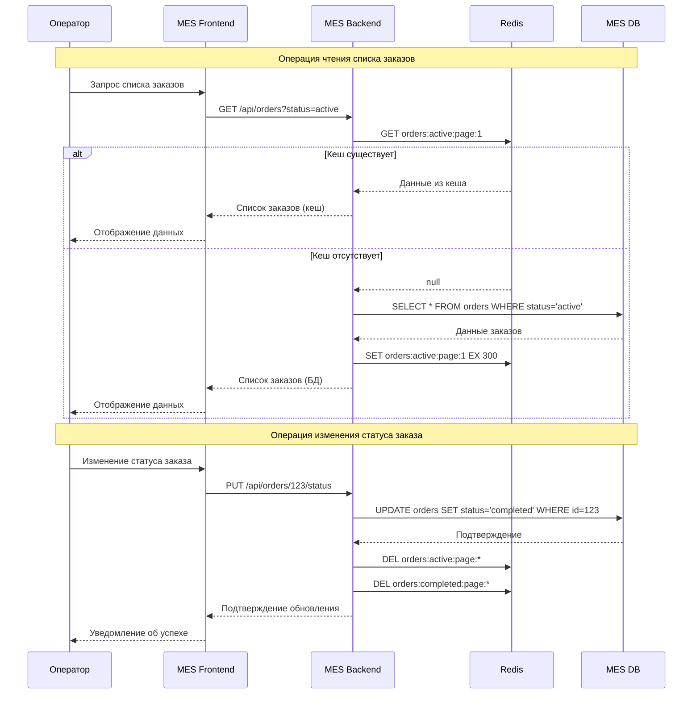

# Архитектурное решение по кешированию

## Мотивация

### Проблемы производительности

- Медленная загрузка дашборда MES (30+ секунд)
- Высокая нагрузка на базу данных при частых запросах списков заказов
- Долгий расчет стоимости 3D-моделей (до 30 минут)
- Конкуренция операторов за новые заказы из-за задержек обновления

### Цели внедрения кеширования

- Сократить время загрузки дашборда MES
- Снизить нагрузку на базу данных
- Ускорить повторные расчеты стоимости заказов
- Обеспечить актуальность данных для операторов

### Элементы системы для кеширования

| Компонент | Тип данных                         | Приоритет |
|-----------|------------------------------------|-----------|
| MES API   | Списки заказов по статусам         | Высокий   |
| MES API   | Результаты расчетов стоимости      | Высокий   |
| MES DB    | Справочники (операторы, материалы) | Средний   |
| Shop API  | Данные о товарах и компонентах     | Низкий    |

## Предлагаемое решение

### Тип кеширования: Серверное

**Обоснование выбора:**

- Централизованное управление кешем для всех операторов
- Возможность тонкой настройки политик инвалидации
- Высокая производительность при частых чтениях
- Простота интеграции с существующей архитектурой

### Паттерны кеширования

#### 1. Cache-Aside для списков заказов

Обоснование выбора:

Данные списков заказов часто читаются, но редко обновляются массово

Простота реализации и минимальное влияние на существующий код

Естественное устаревание данных через TTL обеспечивает баланс между производительностью и актуальностью

Позволяет избежать сложных механизмов инвалидации при единичных изменениях

#### 2. Write-Through для обновления статусов

Обновление в кеше и БД атомарно

Обоснование выбора:

Статусы заказов критичны для бизнес-процессов и требуют мгновенной согласованности

Изменения статусов происходят реже чем чтения, поэтому overhead записи приемлем

Гарантирует, что все операторы видят актуальное состояние заказов

Исключает ситуации конкуренции при взятии заказов в работу

#### 3. Memoization для расчетов стоимости

Обоснование выбора:

Расчеты стоимости являются детерминированными для одинаковых входных данных

Долгое время выполнения (до 30 минут) делает кеширование критически важным

Клиенты часто запрашивают расчет для одинаковых или похожих конфигураций

Длительный TTL оправдан стабильностью ценовых параметров

### Диаграмма последовательности

### Стратегия инвалидации кеша

**Комбинированный подход:**

- **Временная инвалидация (TTL):** Автоматическое устаревание данных
- **Программная инвалидация:** Точечное удаление при изменениях
- **По событиям:** Реакция на бизнес-события (изменение статуса)

**Настройки TTL:**

- Списки заказов: 5 минут
- Данные расчета стоимости: 24 часа
- Справочники: 1 час
- Статусы заказов: 1 минута

**Критерии выбора стратегии:**

| Стратегия       | Подходит для                       | Не подходит для                 |
|-----------------|------------------------------------|---------------------------------|
| **TTL**         | Данные с естественным устареванием | Критичные к актуальности данные |
| **По ключу**    | Точечные обновления                | Массовые изменения              |
| **По событиям** | Сложные бизнес-процессы            | Простые сценарии                |

## Техническая реализация

### Безопасность

- Шифрование данных при передаче (TLS)
- Аутентификация доступа к Redis
- Маскирование чувствительных данных в кеше
- Разделение прав доступа по ролям

### Политика хранения

- Максимальный размер кеша: 2 ГБ
- Алгоритм вытеснения: LRU (Least Recently Used)
- Резервное копирование конфигураций
- Мониторинг использования памяти

## Ожидаемые результаты

### Технические метрики

- Время загрузки дашборда: с 30+ сек до 3-5 сек
- Нагрузка на БД: снижение на 60-70%
- Hit-rate кеша: > 85%
- Время отклика API: улучшение на 50%

### Бизнес-метрики

- Увеличение производительности операторов на 30%
- Сокращение времени обработки заказов на 25%
- Уменьшение количества жалоб на 40%
- Повышение удовлетворенности клиентов

## План внедрения

### Этап 1 (2-3 недели): Базовая настройка

- Развертывание Redis кластера
- Интеграция кеширования в MES API
- Настройка мониторинга

### Этап 2 (3-4 недели): Оптимизация

- Внедрение паттернов кеширования
- Настройка стратегий инвалидации
- Нагрузочное тестирование

### Этап 3 (2-3 недели): Масштабирование

- Расширение на другие компоненты системы
- Тонкая настройка параметров
- Документирование решения

## Риски и ограничения

### Технические риски

- Возможная несогласованность данных
- Увеличение сложности системы
- Зависимость от дополнительной инфраструктуры

### Меры минимизации

- Тщательное тестирование сценариев
- Поэтапное внедрение с откатом
- Мониторинг и алертинг

### Ограничения

- Объем памяти Redis кластера
- Стоимость дополнительной инфраструктуры
- Время на обучение команды
